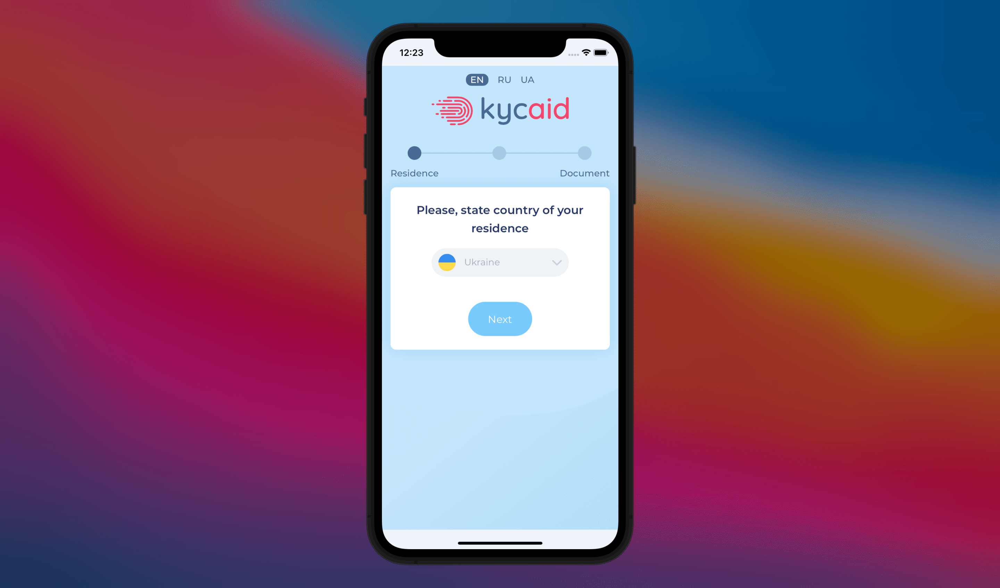

# KYCAID React Native SDK
A React Native component that allows you to quickly integrate the KYCAID service to identify your customer (KYC/KYB).



## Installation   

```bash
$ npm install @kyciad/react-native-sdk
```
   
## Usage
    
```jsx
import React from 'react';
import { SafeAreaView } from 'react-native';
import { KYCAID } from '@kycaid/react-native-sdk';

function App() {
    const handleVerificationCallback = (data) => {
        console.log(`Callback successfully received!`);
        console.log(`Verification ${data?.verification_id} has status: ${data?.status}`);
    };

    return (
        <SafeAreaView>
            <KYCAID
                config={{
                    api_token: '<api_token>',
                    form_id: '<form_id>',
                    response_url: '<response_url>',
                }}
                verificationCallback={handleVerificationCallback}
            />
        </SafeAreaView>
    )
}
```

## Documentation

[Additional API reference](https://www.npmjs.com/package/react-native-create-lib)   
    
   